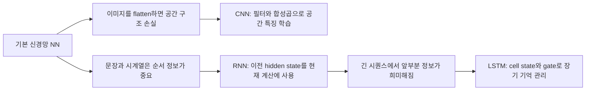
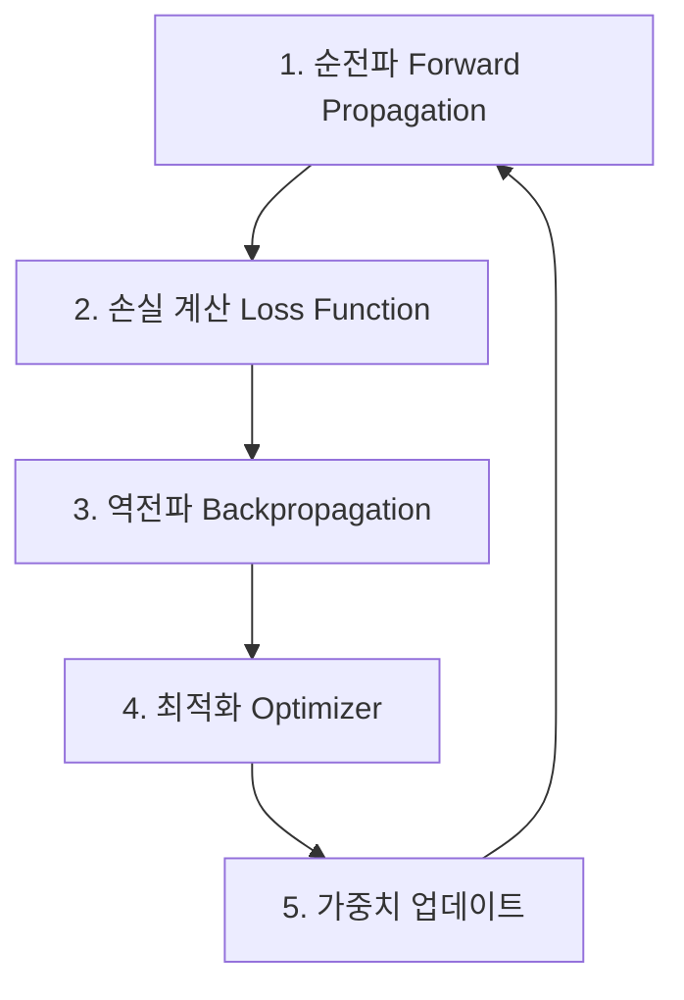
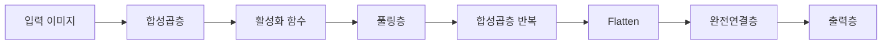
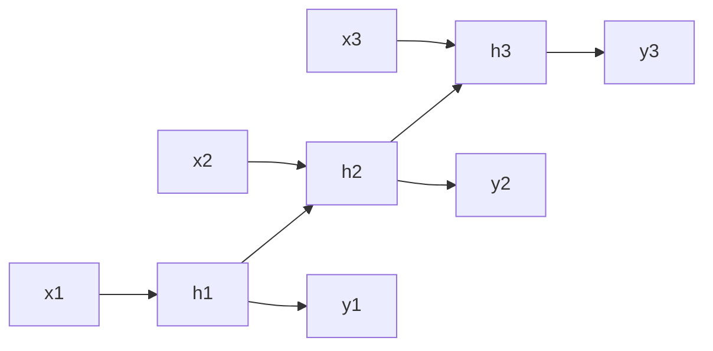
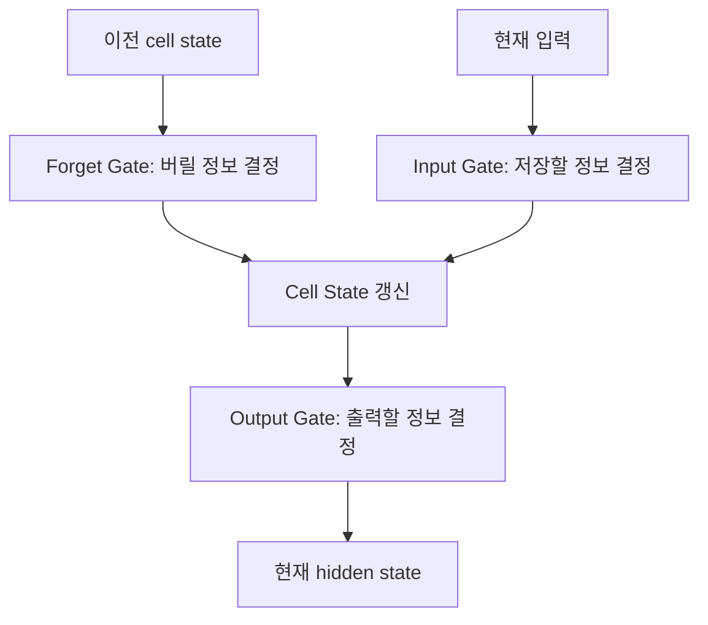

# 인공지능개론: CNN, RNN, LSTM 정리

> 딥러닝에서는 사람이 특징을 직접 설계하기보다 원본 데이터(raw data)를 모델에 넣고, 모델이 학습을 통해 유용한 특징을 찾도록 한다.  
> CNN은 **공간 구조**, RNN은 **순서 정보**, LSTM은 **긴 순서 정보의 기억 문제**를 다루기 위해 등장한 신경망 구조이다.

---

## 목차

1. [핵심 요약](#1-핵심-요약)
2. [선행 개념: 기본 신경망 NN](#2-선행-개념-기본-신경망-nn)
3. [CNN: 이미지의 공간 구조를 다루는 신경망](#3-cnn-이미지의-공간-구조를-다루는-신경망)
4. [RNN: 순서 데이터를 다루는 신경망](#4-rnn-순서-데이터를-다루는-신경망)
5. [LSTM: 긴 문맥을 더 잘 기억하는 RNN 계열 모델](#5-lstm-긴-문맥을-더-잘-기억하는-rnn-계열-모델)
6. [CNN, RNN, LSTM 비교](#6-cnn-rnn-lstm-비교)
7. [선행 개념과의 연결](#7-선행-개념과의-연결)
8. [자주 헷갈리는 포인트](#8-자주-헷갈리는-포인트)
9. [시험 대비 포인트](#9-시험-대비-포인트)
10. [5분 복습 정리](#10-5분-복습-정리)

---

## 1. 핵심 요약

| 모델 | 핵심 대상 | 보존해야 하는 정보 | 핵심 구조 | 대표 사용 분야 |
|---|---|---|---|---|
| NN | 일반 벡터 데이터 | 입력과 출력의 관계 | 가중치, 바이어스, 활성화 함수 | 기본 분류, 회귀 |
| CNN | 이미지, 영상 | 공간적 관계 | 필터, 합성곱, 특징맵, 풀링 | 이미지 분류, 객체 인식, 영상처리 |
| RNN | 문장, 음성, 시계열 | 순서 정보 | hidden state, 반복 구조 | 텍스트 처리, 음성 처리, 시계열 예측 |
| LSTM | 긴 문장, 긴 시계열 | 장기 의존성 | cell state, gate | 긴 문맥 처리, 번역, 음성, 시계열 |

핵심 흐름은 다음과 같다.



---

## 2. 선행 개념: 기본 신경망 NN

### 2.1 신경망의 기본 구조

신경망(Neural Network, NN)은 여러 뉴런을 층(layer)으로 쌓은 모델이다.

기본 구조는 다음과 같다.

```text
입력층(Input Layer)
→ 은닉층(Hidden Layer)
→ 출력층(Output Layer)
```

각 뉴런은 입력값을 받아 다음 계산을 수행한다.

```text
출력 = 활성화함수(Wx + b)
```

- `W`: 가중치(weight)
- `b`: 바이어스(bias)
- `x`: 입력값
- 활성화 함수(activation function): 비선형성을 추가하는 함수

즉, 신경망은 입력값에 가중치를 곱하고 바이어스를 더한 뒤, 활성화 함수를 통과시켜 출력을 만든다.

---

### 2.2 신경망이 학습하는 것

신경망이 학습하는 핵심 값은 다음 두 가지이다.

| 학습 대상 | 의미 |
|---|---|
| 가중치 `W` | 입력값의 중요도를 조절하는 값 |
| 바이어스 `b` | 출력 기준을 이동시키는 값 |

따라서 신경망 학습은 손실이 작아지도록 적절한 `W`와 `b`를 찾는 과정이다.

---

### 2.3 딥러닝 학습 과정

신경망 학습은 다음 흐름으로 진행된다.



1. **순전파(Forward Propagation)**  
   입력 데이터를 모델에 넣고 예측값을 계산한다.

2. **손실함수(Loss Function)**  
   예측값과 실제 정답의 차이를 계산한다.

3. **역전파(Backpropagation)**  
   오차가 각 가중치에 얼마나 영향을 주었는지 계산한다.

4. **최적화(Optimizer)**  
   가중치를 어느 방향으로 얼마나 수정할지 결정한다.

5. **반복 학습**  
   손실이 줄어들도록 위 과정을 반복한다.

---

### 2.4 경사하강법과 학습률

경사하강법(Gradient Descent)은 손실함수를 줄이는 방향으로 가중치를 수정하는 방법이다.

```text
W(t+1) = W(t) - 학습률 × Gradient
```

- `W(t)`: 현재 가중치
- `W(t+1)`: 업데이트 후 가중치
- `Gradient`: 손실함수의 기울기
- 학습률(learning rate): 한 번에 가중치를 얼마나 변경할지 정하는 값

학습률에 따른 문제는 다음과 같다.

| 학습률 | 결과 |
|---|---|
| 너무 작음 | 학습이 매우 느림 |
| 너무 큼 | 최적점을 지나쳐 발산할 수 있음 |

---

### 2.5 활성화 함수가 필요한 이유

선형 계산만 계속 쌓으면 여러 층을 쌓아도 결국 하나의 선형 함수와 같다.

예를 들어 다음과 같은 계산만 반복한다고 하자.

```text
Wx + b
```

이런 선형 레이어를 여러 개 쌓아도 전체적으로는 하나의 큰 선형 함수로 합쳐질 수 있다.  
따라서 복잡한 패턴을 학습하기 어렵다.

그래서 신경망 중간에 활성화 함수(activation function)를 넣는다.

활성화 함수의 역할은 다음과 같다.

- 신경망에 비선형성(non-linearity)을 추가한다.
- 단순 직선 관계가 아닌 복잡한 패턴을 학습할 수 있게 한다.
- 깊은 신경망이 의미 있는 표현력을 갖게 만든다.

---

### 2.6 그래디언트 소실

그래디언트 소실(vanishing gradient)은 역전파 과정에서 기울기 값이 너무 작아지는 문제이다.

기울기가 너무 작아지면 다음 문제가 생긴다.

- 앞쪽 층까지 학습 신호가 잘 전달되지 않는다.
- 앞쪽 층의 가중치가 거의 업데이트되지 않는다.
- 깊은 신경망이 제대로 학습되지 않을 수 있다.

이 개념은 RNN과 LSTM을 이해할 때 중요하다.  
RNN에서는 깊이가 공간 방향이 아니라 **시간 방향**으로 길어진다고 생각할 수 있기 때문이다.

---

## 3. CNN: 이미지의 공간 구조를 다루는 신경망

### 3.1 CNN이 등장한 이유

일반 NN에 이미지를 넣으려면 보통 이미지를 1차원 벡터로 펼친다.  
이 과정을 평탄화(flatten)라고 한다.

예를 들어 `28 × 28` 크기의 이미지는 `784`개의 숫자로 펼칠 수 있다.

```text
28 × 28 이미지
→ flatten
→ 784차원 벡터
```

하지만 이미지를 1차원으로 펼치면 문제가 생긴다.

- 원래 가까이 있던 픽셀 간의 관계가 약해진다.
- 선, 모서리, 곡선 같은 지역적 특징을 파악하기 어렵다.
- 이미지의 공간 구조(spatial structure)가 깨진다.

이미지에서는 픽셀의 값 자체만 중요한 것이 아니라 픽셀들이 **어디에 있고, 어떻게 연결되어 있는지**가 중요하다.  
이 공간적 관계를 보존하며 특징을 학습하기 위해 CNN이 사용된다.

---

### 3.2 CNN의 핵심 아이디어

CNN(Convolutional Neural Network)은 이미지의 작은 영역을 필터(filter)로 훑으면서 특징을 추출하는 신경망이다.

기본 흐름은 다음과 같다.

```text
원본 이미지
→ 필터 적용
→ 합성곱 연산
→ 특징맵(feature map) 생성
→ 풀링(pooling)
→ 분류 또는 예측
```

CNN은 이미지를 한 번에 전체로 보는 것이 아니라 작은 영역을 보면서 지역적인 특징을 찾는다.

예를 들어 CNN은 학습을 통해 다음 특징을 잡을 수 있다.

- 선(edge)
- 모서리(corner)
- 곡선(curve)
- 질감(texture)
- 물체의 일부(part)
- 전체 형태(shape)

---

### 3.3 합성곱 연산

합성곱(convolution)은 CNN의 핵심 연산이다.

합성곱 과정은 다음과 같다.

1. 이미지의 작은 부분에 필터를 올린다.
2. 같은 위치의 이미지 값과 필터 값을 곱한다.
3. 곱한 값들을 모두 더한다.
4. 그 결과가 특징맵의 한 칸이 된다.
5. 필터를 일정 간격으로 이동하며 같은 과정을 반복한다.

간단히 표현하면 다음과 같다.

```text
이미지의 작은 영역 × 필터
→ 위치별 곱셈
→ 합산
→ 특징맵의 한 값
```

즉, 필터는 이미지 안에서 특정 패턴이 나타나는 위치를 찾는 역할을 한다.

---

### 3.4 필터는 학습되는 값이다

CNN에서 중요한 점은 필터가 사람이 직접 정해준 고정 규칙이 아니라는 것이다.

| 시점 | 필터 값 |
|---|---|
| 학습 전 | 랜덤 값 |
| 학습 후 | 특징을 잘 잡는 값 |

즉, CNN의 필터도 신경망의 가중치처럼 학습된다.

- 처음에는 랜덤한 필터로 시작한다.
- 순전파를 통해 예측값을 계산한다.
- 손실을 계산한다.
- 역전파를 통해 필터 값이 업데이트된다.
- 반복 학습 후에는 이미지 특징을 잘 잡는 필터가 된다.

따라서 CNN은 사람이 직접 특징을 설계하는 방식이 아니라, 데이터로부터 특징 추출 방식을 학습하는 모델이다.

---

### 3.5 특징맵

특징맵(feature map)은 필터를 이미지에 적용한 결과이다.

특징맵은 다음 의미를 가진다.

- 특정 필터가 이미지의 어느 위치에서 강하게 반응했는지 나타낸다.
- 예를 들어 세로선을 찾는 필터라면, 세로선이 있는 위치에서 큰 값이 나올 수 있다.
- 필터가 여러 개이면 여러 종류의 특징맵이 생성된다.

필터가 많아질수록 CNN은 다양한 특징을 동시에 학습할 수 있다.

```text
필터 1 → 선 특징맵
필터 2 → 모서리 특징맵
필터 3 → 곡선 특징맵
...
```

---

### 3.6 풀링

합성곱을 수행하면 특징맵이 만들어진다.  
하지만 특징맵의 크기가 크거나 위치 변화에 너무 민감하면 문제가 생길 수 있다.

이를 해결하기 위해 풀링(pooling)을 사용한다.

풀링의 핵심 기능은 다음 두 가지이다.

| 기능 | 설명 |
|---|---|
| 정보 요약 | 중요한 특징만 남기고 크기를 줄인다. |
| 이동 불변성 | 물체가 조금 움직여도 비슷하게 인식하도록 만든다. |

예를 들어 숫자 `3`이 이미지 중앙에서 약간 왼쪽으로 이동해도 여전히 `3`으로 인식해야 한다.  
풀링은 이런 작은 위치 변화에 둔감하게 만든다.

대표적인 풀링 방식은 다음과 같다.

| 풀링 방식 | 설명 |
|---|---|
| Max Pooling | 영역 안에서 가장 큰 값을 선택한다. |
| Average Pooling | 영역 안의 평균값을 사용한다. |

---

### 3.7 Stride와 Padding

CNN에서 필터는 이미지를 조금씩 이동하며 계산한다.  
이때 중요한 개념이 stride와 padding이다.

| 개념 | 의미 | 효과 |
|---|---|---|
| Stride | 필터가 한 번에 이동하는 거리 | stride가 클수록 출력 크기가 작아진다. |
| Padding | 이미지 가장자리에 값을 추가하는 것 | 가장자리 정보 손실을 줄이고 출력 크기를 조절한다. |

예를 들어 stride가 1이면 필터가 한 칸씩 이동하고, stride가 2이면 두 칸씩 이동한다.

Padding은 보통 이미지 가장자리에 0을 추가하는 방식으로 사용된다. 이를 zero padding이라고 한다.

---

### 3.8 CNN의 전체 구조

CNN의 일반적인 구조는 다음과 같이 이해할 수 있다.



CNN에서도 활성화 함수가 필요하다.  
합성곱도 기본적으로는 선형 연산이므로, 활성화 함수가 없으면 복잡한 비선형 패턴을 충분히 학습하기 어렵다.

---

## 4. RNN: 순서 데이터를 다루는 신경망

### 4.1 RNN이 등장한 이유

CNN은 이미지처럼 공간 구조가 중요한 데이터에 강하다.  
하지만 모든 데이터가 이미지처럼 공간 구조를 가지는 것은 아니다.

문장, 음성, 시계열 데이터에서는 순서가 중요하다.

| 데이터 | 중요한 이유 |
|---|---|
| 문장 | 단어의 순서에 따라 의미가 달라진다. |
| 음성 | 시간 순서에 따라 발음과 의미가 결정된다. |
| 주가 데이터 | 이전 시점의 값이 이후 값에 영향을 줄 수 있다. |
| 센서 데이터 | 시간에 따른 변화 흐름이 중요하다. |

이미지에서는 공간 관계를 보존해야 했다면, 문장이나 시계열에서는 순서 정보를 보존해야 한다.

이 순서 정보를 다루기 위해 등장한 모델이 RNN이다.

---

### 4.2 RNN의 핵심 아이디어

RNN(Recurrent Neural Network)은 현재 입력만 보는 것이 아니라 이전 시점의 정보를 함께 사용한다.

기본 흐름은 다음과 같다.

```text
현재 입력 x_t + 이전 기억 h_(t-1)
→ 현재 기억 h_t
→ 출력 y_t
```

여기서 `h_t`는 hidden state이다.

hidden state는 이전까지 읽은 정보의 요약이라고 볼 수 있다.

---

### 4.3 RNN의 문장 처리 예시

문장:

```text
나는 / 학교에 / 간다
```

RNN은 단어를 순서대로 읽으며 hidden state를 갱신한다.

| 시점 | 입력 | hidden state의 의미 |
|---|---|---|
| 1단계 | 나는 | "나는"에 대한 기억 |
| 2단계 | 학교에 | "나는 + 학교에"를 반영한 기억 |
| 3단계 | 간다 | "나는 학교에 간다"를 반영한 기억 |

즉, RNN은 단어를 하나씩 읽으면서 이전 정보를 hidden state에 담아 다음 단계로 넘긴다.

---

### 4.4 RNN의 구조적 특징

RNN은 같은 구조를 시간 방향으로 반복해서 사용한다.



일반 신경망은 입력이 한 번 들어가고 출력이 나오지만, RNN은 입력이 순서대로 들어가며 각 시점의 결과가 다음 시점에 영향을 준다.

따라서 RNN은 시간 방향으로 펼쳐진 신경망처럼 이해할 수 있다.

---

### 4.5 RNN의 장점

RNN의 장점은 순서 정보를 반영할 수 있다는 점이다.

일반 NN은 각 입력을 독립적으로 처리하는 경향이 있지만, RNN은 이전 입력의 영향을 현재 계산에 반영한다.

RNN은 다음 작업에 사용할 수 있다.

- 문장 처리
- 음성 인식
- 번역
- 감정 분석
- 시계열 예측
- 음악 생성
- 텍스트 생성

---

### 4.6 RNN의 한계

RNN의 가장 큰 약점은 긴 시퀀스에서 앞부분 정보를 오래 유지하기 어렵다는 점이다.

시퀀스가 길어질수록 다음 문제가 생긴다.

- 앞쪽 입력 정보가 hidden state 안에서 희미해진다.
- 뒤쪽 시점으로 갈수록 앞부분 정보의 영향이 약해질 수 있다.
- 긴 문맥을 처리하기 어렵다.

예를 들어 긴 문장에서 앞부분에 나온 중요한 단어가 문장 끝의 의미를 결정할 수도 있다.  
하지만 일반 RNN은 그 정보를 끝까지 유지하기 어렵다.

---

### 4.7 RNN과 그래디언트 소실

RNN의 한계는 그래디언트 소실 문제와 연결된다.

일반 깊은 신경망에서는 층이 깊어질수록 앞쪽 층까지 기울기가 잘 전달되지 않을 수 있다.

RNN에서는 시간 방향으로 길게 펼쳐진 구조에서 앞쪽 시점까지 기울기가 잘 전달되지 않을 수 있다.

```text
깊은 NN의 앞쪽 층 학습이 약해짐
=
긴 RNN의 앞쪽 시점 학습이 약해짐
```

즉, RNN에서 시퀀스가 길다는 것은 깊은 신경망에서 층이 깊다는 것과 비슷하게 이해할 수 있다.

---

## 5. LSTM: 긴 문맥을 더 잘 기억하는 RNN 계열 모델

### 5.1 LSTM이 등장한 이유

LSTM(Long Short-Term Memory)은 RNN이 긴 정보를 잘 기억하지 못하는 문제를 완화하기 위해 만들어진 구조이다.

일반 RNN은 hidden state 하나에 많은 정보를 계속 담으려고 한다.

하지만 시퀀스가 길어지면 다음 문제가 발생할 수 있다.

- 중요한 정보가 사라진다.
- 불필요한 정보가 계속 섞인다.
- 앞부분 정보가 뒤쪽까지 잘 전달되지 않는다.

LSTM은 이 문제를 해결하기 위해 정보를 더 정교하게 관리한다.

---

### 5.2 LSTM의 핵심 구조

LSTM은 크게 세 가지 요소로 이해할 수 있다.

```text
LSTM = hidden state + cell state + gate
```

| 구성 요소 | 역할 |
|---|---|
| Hidden State | 현재 시점의 출력에 가까운 정보 |
| Cell State | 장기 기억을 담당하는 정보 통로 |
| Gate | 정보를 얼마나 버리고, 저장하고, 출력할지 조절하는 장치 |

일반 RNN은 hidden state 하나에 정보를 담으려 하지만, LSTM은 hidden state와 cell state를 구분한다.

이 중 cell state는 장기 기억을 담당하는 핵심 통로이다.

---

### 5.3 LSTM의 세 가지 Gate

LSTM에는 대표적으로 세 가지 gate가 있다.

| Gate | 역할 | 질문 형태로 이해하기 |
|---|---|---|
| Forget Gate | 이전 기억 중 무엇을 버릴지 결정 | 이전 기억 중 무엇을 지울까? |
| Input Gate | 현재 입력 중 무엇을 새로 저장할지 결정 | 현재 정보 중 무엇을 저장할까? |
| Output Gate | 기억 중 무엇을 출력으로 내보낼지 결정 | 현재 출력으로 무엇을 보여줄까? |

Gate는 정보의 통과 정도를 조절한다.  
중요한 정보는 오래 유지하고, 불필요한 정보는 줄인다.

---

### 5.4 LSTM의 처리 흐름

LSTM은 각 시점에서 다음 질문을 한다.

1. 이전 기억 중 무엇을 버릴까?
2. 현재 입력 중 무엇을 새로 저장할까?
3. 장기 기억인 cell state를 어떻게 갱신할까?
4. 현재 출력으로 무엇을 내보낼까?

흐름을 간단히 나타내면 다음과 같다.



이 구조 덕분에 LSTM은 일반 RNN보다 긴 문맥을 더 잘 유지할 수 있다.

---

### 5.5 RNN과 LSTM의 차이

| 구분 | RNN | LSTM |
|---|---|---|
| 기억 구조 | hidden state 중심 | hidden state + cell state |
| 장기 기억 | 약함 | 상대적으로 강함 |
| 정보 조절 | 단순함 | gate로 저장, 삭제, 출력 조절 |
| 긴 시퀀스 처리 | 앞부분 정보가 희미해지기 쉬움 | 긴 문맥을 더 잘 유지 |
| 그래디언트 소실 | 취약함 | 완화 가능 |

LSTM은 단순히 “기억을 잘하는 RNN”이 아니라, 장기 의존성과 그래디언트 소실 문제를 줄이기 위해 구조적으로 개선된 RNN 계열 모델이다.

---

## 6. CNN, RNN, LSTM 비교

### 6.1 핵심 비교

| 항목 | CNN | RNN | LSTM |
|---|---|---|---|
| 주로 다루는 데이터 | 이미지, 영상 | 문장, 음성, 시계열 | 긴 문장, 긴 시계열 |
| 중요한 정보 | 공간 구조 | 순서 정보 | 장기 순서 정보 |
| 핵심 개념 | 필터, 합성곱, 특징맵, 풀링 | hidden state | cell state, gate |
| 강점 | 지역적 특징 추출 | 이전 시점 정보 반영 | 긴 문맥 유지 |
| 약점 | 순서 데이터 처리에는 직접적이지 않음 | 긴 시퀀스에서 정보 손실 | RNN보다 구조가 복잡함 |
| 대표 예시 | 이미지 분류, 객체 인식 | 감정 분석, 시계열 예측 | 번역, 긴 문장 처리, 긴 시계열 예측 |

---

### 6.2 데이터 관점 비교

| 데이터 유형 | 중요한 정보 | 적합한 모델 | 이유 |
|---|---|---|---|
| 이미지 | 픽셀 간 공간 관계 | CNN | 필터로 지역적 특징을 추출할 수 있음 |
| 문장 | 단어의 순서 | RNN, LSTM | 이전 단어의 정보가 현재 단어 해석에 영향을 줌 |
| 음성 | 시간 순서 | RNN, LSTM | 시간 흐름에 따라 의미가 결정됨 |
| 긴 시계열 | 오래전 정보와 현재 정보의 관계 | LSTM | cell state로 장기 기억을 관리할 수 있음 |

---

## 7. 선행 개념과의 연결

### 7.1 NN과 CNN의 연결

기본 NN은 가중치 `W`와 바이어스 `b`를 학습한다.  
CNN도 학습하는 모델이며, CNN에서는 필터의 값이 학습된다.

```text
NN의 가중치 학습
→ CNN의 필터 학습
```

즉, CNN의 필터는 이미지에서 특징을 찾기 위한 학습 가능한 가중치라고 이해할 수 있다.

---

### 7.2 영상처리와 CNN의 연결

영상처리에서 필터는 이미지의 특징을 추출하는 데 사용된다.

예시:

- 엣지 검출 필터
- 블러 필터
- 샤프닝 필터

CNN에서도 필터를 사용한다.

차이점은 다음과 같다.

| 구분 | 전통적 영상처리 필터 | CNN 필터 |
|---|---|---|
| 설계 방식 | 사람이 직접 설계 | 데이터로부터 학습 |
| 목적 | 정해진 효과 적용 | 분류나 예측에 유리한 특징 추출 |
| 값의 변화 | 고정 | 학습 중 업데이트 |

따라서 CNN은 영상처리의 필터 개념을 딥러닝 방식으로 확장한 것으로 이해할 수 있다.

---

### 7.3 RNN과 반복 구조의 연결

RNN은 같은 구조를 시간 방향으로 반복해서 사용한다.  
프로그래밍 관점에서는 이전 결과를 다음 반복에 넘기는 반복문과 비슷하게 이해할 수 있다.

```text
첫 번째 입력 처리
→ hidden state 갱신
→ 두 번째 입력 처리
→ hidden state 갱신
→ 세 번째 입력 처리
→ hidden state 갱신
```

즉, RNN은 이전 계산 결과를 다음 계산의 입력 일부로 사용한다.

---

### 7.4 그래디언트 소실과 LSTM의 연결

그래디언트 소실은 깊은 신경망에서 앞쪽 층이 잘 학습되지 않는 문제이다.

RNN에서는 시간 방향으로 길게 펼쳐졌을 때 앞쪽 시점이 잘 학습되지 않는 문제가 발생할 수 있다.

LSTM은 cell state와 gate를 통해 이 문제를 완화한다.

```text
RNN의 문제:
긴 시퀀스에서 앞부분 정보가 사라짐

LSTM의 보완:
cell state로 장기 기억 통로를 만들고 gate로 정보를 선택적으로 관리함
```

---


